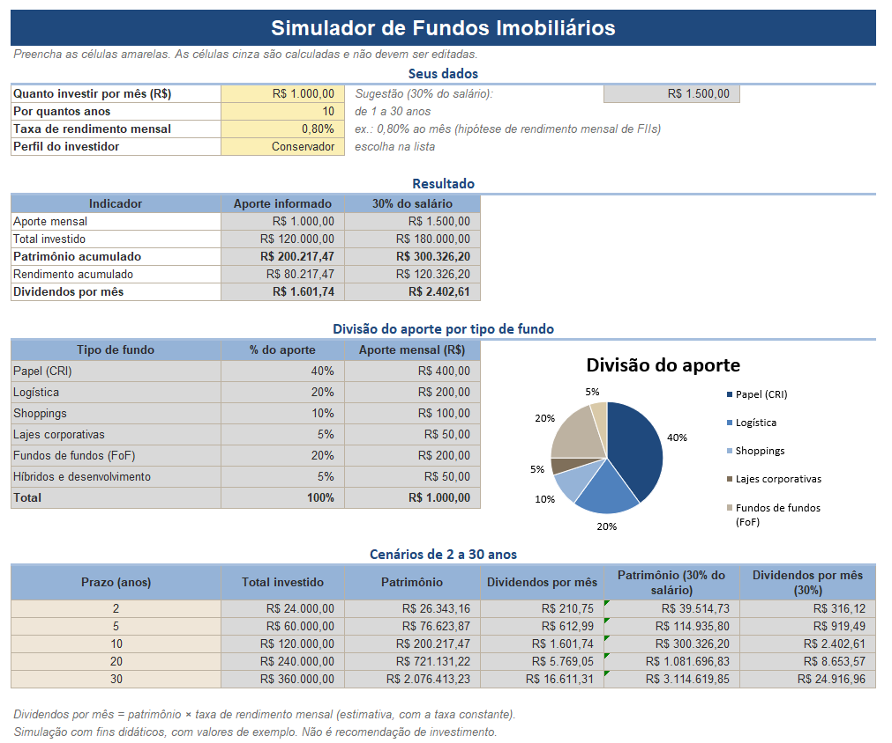
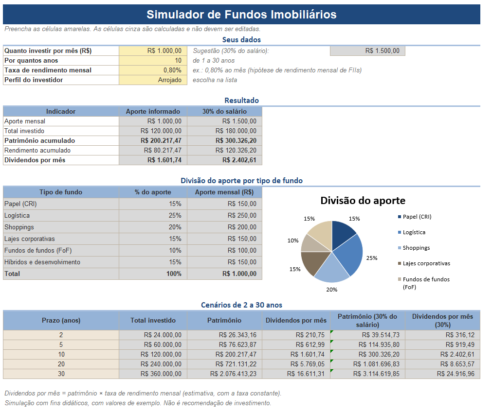

# Simulador de Fundos Imobiliários

Ferramenta em Excel que simula o investimento mensal em fundos imobiliários (FIIs): do aporte de cada
mês ao patrimônio acumulado e aos dividendos mensais. Também projeta o patrimônio em cenários de 2 a
30 anos e divide o aporte entre seis tipos de fundo, conforme o perfil de investidor escolhido numa lista.

Projeto do desafio do curso de Excel (DIO).

> **Aviso:** simulação com fins didáticos. O salário e os valores do arquivo são de exemplo, e os
> percentuais de cada perfil não são recomendação de investimento.

## Prints

Mesma simulação (aporte de R$ 1.000, 10 anos, rendimento de 0,80% ao mês) em dois perfis. O patrimônio e
os dividendos não mudam, porque o perfil só altera a divisão do aporte entre os tipos de fundo.

| Perfil Conservador | Perfil Arrojado |
|---|---|
|  |  |

## Como usar

1. Baixe [`planilha/simulador-fundos-imobiliarios.xlsx`](planilha/simulador-fundos-imobiliarios.xlsx) e abra no Excel.
2. Na aba **Simulador**, preencha as células amarelas: aporte mensal, anos, taxa de rendimento mensal e perfil.
3. As células cinza são calculadas e não devem ser editadas.

## Perguntas que a ferramenta responde

| Pergunta | Onde aparece (aba Simulador) |
|---|---|
| Quanto investir por mês? | **C6** (entrada). Ao lado, em **F6**, a sugestão de 30% do salário |
| Por quantos anos? | **C7** (entrada, de 1 a 30) |
| Qual a taxa de rendimento mensal? | **C8** (entrada) |
| Quanto de patrimônio vai acumular? | **C15** (e **D15** para o aporte de 30% do salário). Cenários em **D31:D35** |
| Quanto vai receber de dividendos por mês? | **C17** (e **D17**). Cenários em **E31:E35** |

A seção 3 mostra a divisão do aporte por tipo de fundo (com gráfico de pizza) e a seção 4, os cenários de
2, 5, 10, 20 e 30 anos.

## Como o VF e o PROCV entram nos cálculos

**VF (valor futuro).** Calcula o patrimônio de aportes mensais iguais com rendimento composto:

```
=VF(taxa_mensal; anos*12; -aporte)
```

- `taxa_mensal`: rendimento por mês (o período da taxa precisa ser o mesmo do número de períodos).
- `anos*12`: número de meses.
- `-aporte`: o pagamento entra negativo (dinheiro que sai do bolso) para o resultado vir positivo.

Os dividendos mensais são uma estimativa: `patrimônio × taxa_mensal`.

**PROCV com chave composta.** Para achar o percentual de cada tipo de fundo em cada perfil, a aba
**Perfis** tem uma coluna **Chave** que junta perfil e tipo (ex.: `Moderado|Logística`). Na aba Simulador:

```
=PROCV(perfil&"|"&B21; tabela_perfis; 4; FALSO)
```

O PROCV procura a chave montada com o perfil escolhido e o tipo da linha, e devolve a 4ª coluna da
tabela, o percentual. Ao trocar o perfil na lista, toda a divisão do aporte muda.

## Intervalos nomeados

| Nome | Refere-se a |
|---|---|
| `aporte` | Simulador!C6 |
| `anos` | Simulador!C7 |
| `taxa_mensal` | Simulador!C8 |
| `perfil` | Simulador!C9 |
| `patrimonio` | Simulador!C15 |
| `dividendos` | Simulador!C17 |
| `salario` | Configurações!C7 |
| `pct_aporte` | Configurações!C8 (30%) |
| `sugestao_aporte` | Configurações!C9 (salário × percentual) |
| `tabela_perfis` | Perfis!A5:D22 (chave, perfil, tipo, percentual) |
| `lista_perfis` | Perfis!H5:H7 (lista usada na validação de dados) |
| `lista_tipos` | Perfis!F5:F10 |

## Percentuais de cada perfil

| Tipo de fundo | Conservador | Moderado | Arrojado |
|---|---|---|---|
| Papel (CRI) | 40% | 30% | 15% |
| Logística | 20% | 25% | 25% |
| Shoppings | 10% | 15% | 20% |
| Lajes corporativas | 5% | 10% | 15% |
| Fundos de fundos (FoF) | 20% | 15% | 10% |
| Híbridos e desenvolvimento | 5% | 5% | 15% |
| **Total** | **100%** | **100%** | **100%** |

Os percentuais são de exemplo e foram definidos por mim, não vêm de uma recomendação. A lógica usada,
a partir das características de cada segmento descritas pelo [Status Invest](https://statusinvest.com.br/noticias/tipos-de-fundos-imobiliarios-fiis/):

- **Papel e fundos de fundos** pesam mais no perfil conservador. Os fundos de papel têm renda mais previsível, e os FoFs diversificam em vários fundos.
- **Logística, shoppings e lajes** (tijolo) crescem nos perfis mais arrojados. A renda depende de aluguéis e é mais sensível à vacância e à economia.
- **Híbridos e desenvolvimento** aparecem mais no arrojado, pela maior volatilidade e complexidade.

A aba **Perfis** confere se cada perfil soma 100% e destaca em cor de alerta se não somar.

A taxa de **0,80% ao mês** é uma hipótese. Uma matéria do [Money Times](https://www.moneytimes.com.br/fiis-pagam-dividendos-de-ate-129-ao-ano-em-janeiro-ifix-encerra-2025-com-alta-de-21-jals/)
(jan/2026) cita rendimentos mensais de fundos individuais entre cerca de 0,70% e 1,22%.

## O que mudei em relação à ferramenta do Expert

Além do roteiro base do desafio, acrescentei:

- Gráfico de pizza com a divisão do aporte, que muda junto com o perfil.
- Segunda simulação, que usa a sugestão de 30% do salário no lugar do aporte informado, no resultado e nos cenários.
- Validação de dados em todos os campos de entrada (perfil, prazo, aporte e taxa).
- Formatação condicional que avisa quando um perfil não soma 100%.
- Paleta de cores própria (azul, amarelo para entradas e cinza para células calculadas) e tipos de fundo e percentuais escolhidos por mim.

## Estrutura do repositório

```
├── README.md
├── planilha/simulador-fundos-imobiliarios.xlsx
├── imagens/            (prints da ferramenta em dois perfis)
└── docs/premissas-e-fontes.md
```

## Limitações

- A taxa mensal é constante: não considera variação de preço das cotas, vacância nem mudança nos dividendos.
- Não considera imposto sobre ganho de capital, taxas de corretagem ou de administração.
